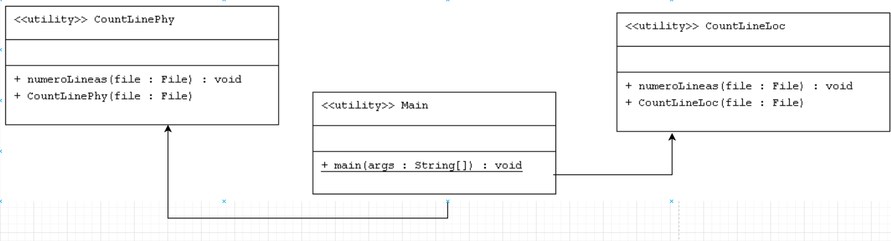
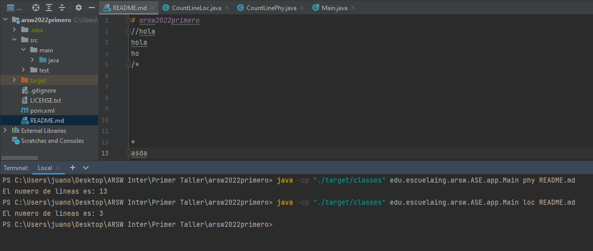

# Lector Phy Loc
### ARSW
### Autor

- Juan Monroy

### Fecha
- 8 Marzo 2022

## Diagrama de clases

La clase CountLinePhy recibe el argumento file que trae el archivo desde la clase Main 
cuenta todas las lineas de codigo.
Mientras que la clase CountLineLoc recibe igualmente el argumento file que trae el 
archivo desde la clase Main, pero esta clase cuenta las lineas de codigo sin contar los 
comentarios, ni las lineas en blanco.


### Funcionalidad


## LOC/H
1. Desde las 11:33, hasta las 12:32 - Fueron en total 12 lineas
2. Desde las 10:10, hasta las 12:14- Fueron en total 23 lineas

LOC = (35/3H)

**LOC = 12**

### Ejecutar el programa
```
java -cp "./target/classes" edu.escuelaing.arsw.ASE.app.Main phy nombredelarchivo.extension
java -cp "./target/classes" edu.escuelaing.arsw.ASE.app.Main loc nombredelarchivo.extension
```

### Generar JavaDoc
```
mvn javadoc:javadoc
```
